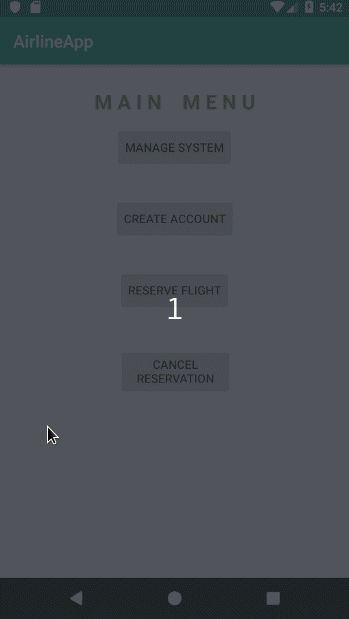

# AirlineApp
Simulates a mobile airline application ✈️

## Description
This andriod app uses the SQLite Database and RecyclerViews. There are 4 core functionalities in this app:

### [Manage System](manage-system)

Only system admins have access to this portion of the app. 

Allows managing user accounts, flights and reservations, i.e. to delete and/or create.

App Activities that are logged:
- Creating and deleting a user account.
- Creating and deleting a flight.
- Creating and canceling a reservation. 

### [Create Account](create-account)

Allows new users to create an account. 

### [Reserve Flight](reserve-flight)

Allows logged in users to reserve a flight of choice.

### [Cancel Reservation](cancel-reservation)

Allows logged in users to cancel flight reservations. 
